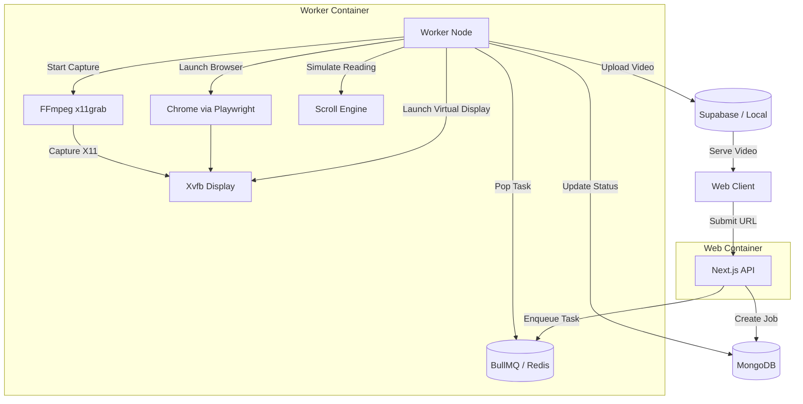

# Presently

Presently is an automated service that converts any website link into a smooth, human-like UI walkthrough video. It spins up a headless browser, records the interaction (such as natural scrolling and reading pauses) inside a virtual X11 display, and outputs an MP4 video of the session.

## Architecture Overview

The system architecture is decoupled into a frontend submission interface and a robust background processing worker. 



### Key Components

1. **Next.js Web App**: Handles user submissions, displays the status of jobs, and serves completed videos. Built with App Router and styled using Tailwind CSS and `shadcn/ui`.
2. **Database (MongoDB / Mongoose)**: Stores the state of recording jobs (pending, processing, completed, failed) and associated metadata.
3. **Task Queue (BullMQ / Redis)**: Manages concurrent recording tasks, ensuring the system doesn't overload the host. Concurrency matches the configured Xvfb display pool.
4. **Worker Service (Bun)**: Orchestrates the actual recording pipeline:
   - **Xvfb**: Creates a virtual X11 display (Wayland compatible via XWayland).
   - **Playwright / Chrome**: Loads the target URL and runs seamlessly within the isolated Xvfb display.
   - **FFmpeg**: Uses `x11grab` to record the virtual display frame by frame, encoding the video asynchronously.
   - **Human-like Scroller**: Emulates realistic scrolling physics and variable reading pauses (skimming vs deep reading) to make the video feel natural.
5. **Storage Mechanism**: Outputs can be saved to the local filesystem or uploaded directly to Supabase Storage for cloud serving.

## Getting Started

### Running with Docker (Recommended)

Presently is packaged using Docker Compose to orchestrate separate containers for the Next.js web interface and the background worker. Both services are built from the same unified `Dockerfile` but run their respective processes.

1. Ensure you have [Docker](https://docs.docker.com/get-docker/) and [Docker Compose](https://docs.docker.com/compose/) installed.
2. Copy the environment template:
   ```bash
   cp .env.example .env.local
   ```
   *(Ensure you configure all necessary keys, including `REDIS_URL`, `MONGODB_URI`, `SUPABASE_URL`, etc).*
3. Build and launch the services:
   ```bash
   docker-compose up -d --build
   ```

This spins up the `web` and `worker` containers. The application will now be available at `http://localhost:3000`.

### Local Development (Native)

If you prefer to run the application natively on your host machine for development:

#### 1. System Dependencies

**Arch Linux (Wayland-compatible)**
```bash
sudo pacman -S xorg-server-xvfb xorg-xdpyinfo ffmpeg redis
yay -S google-chrome
```

**Ubuntu / Debian**
```bash
sudo apt-get install xvfb x11-utils ffmpeg redis-server
```

#### 2. Environment Setup

Copy `.env.example` to `.env.local` and set `CHROME_EXECUTABLE` (e.g., `/usr/bin/google-chrome-stable`), `REDIS_URL`, and other necessary variables.

#### 3. Run the Services

1. **Start Redis**:
   ```bash
   redis-server
   ```
2. **Start the App**:
   ```bash
   bun dev
   ```
3. **Start the Worker** (in a separate terminal):
   ```bash
   bun run worker
   ```

## Under the Hood: The Scroll Engine

Presently features a custom Scroll Engine (`worker/video/scroller.ts`) designed to create organic, engaging walkthroughs. Instead of an automated, instantaneous jump to the bottom of the page, the engine:
- Uses linear interpolation (lerp) for smooth scroll deceleration (easing-out).
- Adjusts "reading pauses" probabilistically to simulate varying reading depth (e.g., 60% quick skims, 15% long reading sessions).
- Adapts dynamically to infinite scroll or lazy-loaded content by continuously re-evaluating the DOM's scroll height.

## Troubleshooting

- **Wayland Notes**: Xvfb works flawlessly via XWayland; no native Wayland alternatives are strictly necessary. The entire browser and FFmpeg pipeline runs invisibly inside the virtual display, bypassing the host compositor completely.
- **Testing Xvfb**: If recordings fail to start, ensure Xvfb is functioning on your system by allocating a display:
  ```bash
  Xvfb :99 -screen 0 1920x1080x24 -ac +extension GLX &
  xdpyinfo -display :99
  ```
