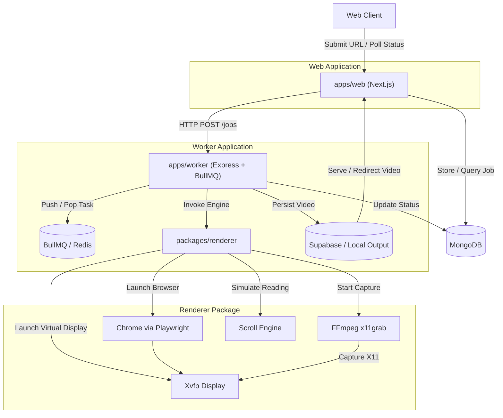

# Sitecast

Sitecast is an automated service that converts any website link into a smooth, human-like UI presentation video. It spins up a headless browser, records the interaction (such as natural scrolling and reading pauses) inside a virtual X11 display, and outputs an MP4 video of the session.

*An example of a video generated by Sitecast:*

<div align="center">
  <video src="https://github.com/user-attachments/assets/ada864bb-05e9-4027-88ff-7f0fdd2994b7" width="100%" controls></video>
</div>

## Architecture Overview

Sitecast is structured as a **pnpm workspace monorepo** managed with **Turborepo**. The core rendering engine is completely decoupled from the UI and background workers.



### Monorepo Structure

```
sitecast/
├── apps/
│   ├── web/                      # Next.js 16 App Router UI & API gateway
│   └── worker/                   # Standalone worker (Express HTTP API + BullMQ queue consumer)
├── packages/
│   ├── renderer/                 # Core rendering engine (Playwright + FFmpeg + Xvfb)
│   ├── shared/                   # Portable TypeScript types, DTOs, and ApiError/ApiResponse
│   └── db/                       # Mongoose database connection & schemas (Job, User)
├── pnpm-workspace.yaml
├── turbo.json
├── package.json                  # Root workspace config
├── Dockerfile                    # Multi-stage Docker build
└── docker-compose.yml
```

### Key Components

1. **`apps/web` (Next.js Web App)**: User interface for submitting URLs, viewing generation status, and watching completed walkthroughs. Communicates with `apps/worker` over HTTP.
2. **`apps/worker` (Worker Application)**:
   - **Express HTTP API**: Receives job submissions (`POST /jobs`) and status queries (`GET /jobs/:jobId`).
   - **BullMQ Consumer**: Manages job queue concurrency with Redis. Delegates rendering to `@sitecast/renderer` and persists the output.
3. **`packages/renderer` (Rendering Engine)**: Pure, framework-independent rendering package:
   - **Xvfb**: Creates an isolated virtual X11 display (Wayland-compatible via XWayland).
   - **Playwright / Chrome**: Loads the target URL and runs within the isolated Xvfb display.
   - **FFmpeg**: Uses `x11grab` to record the virtual display frame by frame.
   - **Human-like Scroller**: Emulates realistic scrolling physics and variable reading pauses.
4. **`packages/db`**: Database connection singleton and Mongoose models (`Job`, `User`) shared by web and worker.
5. **`packages/shared`**: Shared type definitions (`RecordingJob`, `RecordingOptions`, `RecordingResult`) and error/response utilities.

---

## Getting Started

### Prerequisites

- [Node.js](https://nodejs.org/) (v20+)
- [pnpm](https://pnpm.io/) (v9+)
- [Redis](https://redis.io/) (for local queue processing)

---

### Running with Docker (Recommended)

Sitecast uses Docker Compose with multi-stage builds (`web` and `worker` targets) defined in a single `Dockerfile`.

1. Ensure you have [Docker](https://docs.docker.com/get-docker/) and [Docker Compose](https://docs.docker.com/compose/) installed.
2. Copy the environment template:
   ```bash
   cp .env.example .env.local
   ```
   *(Configure `REDIS_URL`, `MONGODB_URI`, `SUPABASE_URL`, `WORKER_URL`, etc.)*
3. Build and launch the containers:
   ```bash
   docker-compose up -d --build
   ```

The web application will be accessible at `http://localhost:3000` and the worker HTTP API at `http://localhost:3001`.

---

### Local Development (Native)

#### 1. System Dependencies

**Arch Linux (Wayland-compatible)**
```bash
sudo pacman -S xorg-server-xvfb xorg-xdpyinfo ffmpeg redis
yay -S google-chrome
```

**Ubuntu / Debian**
```bash
sudo apt-get install xvfb x11-utils ffmpeg redis-server
```

#### 2. Install Workspace Dependencies

```bash
pnpm install
```

#### 3. Environment Setup

Copy `.env.example` to `.env.local` and set all required environment variables:
```bash
cp .env.example .env.local
```

#### 4. Run Development Servers

1. **Start Redis**:
   ```bash
   redis-server
   ```
2. **Start Web & Worker in Dev Mode** (via Turborepo):
   ```bash
   pnpm dev
   ```
   *Or run individually:*
   ```bash
   # Terminal 1 — Worker process (HTTP API + BullMQ)
   pnpm --filter @sitecast/worker dev

   # Terminal 2 — Next.js Web App
   pnpm --filter @sitecast/web dev
   ```

#### 5. Useful Scripts

```bash
pnpm build        # Build all packages and applications via Turbo
pnpm type-check   # Type-check all workspace projects
pnpm lint         # Lint all workspace projects
```

---

## Under the Hood: The Scroll Engine

Sitecast features a custom Scroll Engine (`packages/renderer/src/scroller.ts`) designed to create organic, engaging walkthroughs:
- **Natural Scroll Physics**: Uses linear interpolation (lerp) for smooth deceleration (easing-out).
- **Variable Reading Speed**: Adjusts "reading pauses" probabilistically (skimming vs deep reading).
- **Infinite Scroll Awareness**: Re-evaluates DOM scroll height dynamically as lazy content loads.

---

## Troubleshooting

- **Wayland Notes**: Xvfb works via XWayland; the browser and FFmpeg pipeline run inside the virtual display, bypassing the host compositor completely.
- **Testing Xvfb**: If recordings fail to start, verify Xvfb on your host:
  ```bash
  Xvfb :99 -screen 0 1920x1080x24 -ac +extension GLX &
  xdpyinfo -display :99
  ```
